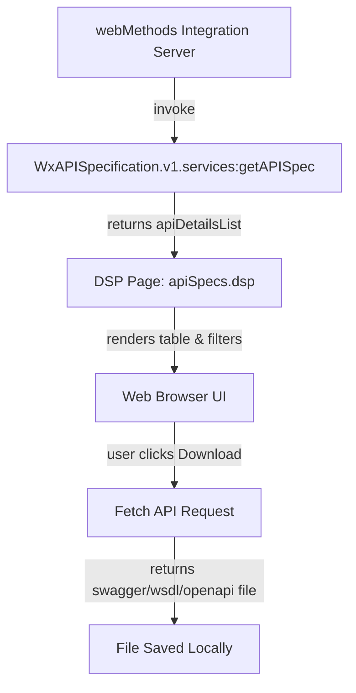

# WxAPISpecification
# 🌐 API Specifications DSP Page

## 🧭 Architecture Overview

📘 README.md – API Specifications DSP Page
🧩 Overview

This DSP (Dynamic Server Page) provides a simple yet powerful UI to view, search, and download API specifications (Swagger, OpenAPI, WSDL) hosted on webMethods Integration Server.

It dynamically lists APIs by Package, API Name, and Type, supports multi-level filtering, and enables downloading specifications directly in the correct format.

🚀 Features

✅ Dynamic API Listing

Fetches API details dynamically from %invoke WxAPISpecification.v1.services:getAPISpec%.

Populates the table with package, API name, type, and endpoint link.

✅ Smart Filtering

Dropdown filters for Package, API Name, and Type.

Global search box filters across Package and API Name.

All filters work together dynamically.

✅ Clear Filters

“Clear Filters” button resets all filters and restores the full table instantly.

✅ Smart Downloads

Automatically detects API type and applies the correct download logic:

Swagger → ?swagger.json → *_swagger.json

OpenAPI → ?openapi.json → *_openapi.json

WSDL → ?wsdl → *.wsdl

Downloads are triggered entirely in-memory using JavaScript fetch() (no page reload).

✅ Clean UI

Responsive and modern look with subtle hover effects.

Auto-refresh every 60 seconds (meta refresh).

⚙️ How It Works

DSP Data Invocation

%invoke dummy:getAPISpec%

Returns a list named apiDetailsList with:

packageName

apiName

type

endpointUrl

Rendering Logic

The %loop apiDetailsList% block renders each API row dynamically.

The apiName is displayed as text after the first colon (:) for readability.

JavaScript captures data-* attributes for dynamic filtering and download handling.

Filter & Search

Dropdowns are populated from unique data values.

Search box filters rows by partial match in Package or API Name.

Filtering is case-insensitive.

Download Logic

On clicking “Download,” a file is fetched and saved locally using the correct filename and extension.

Handles different endpoint variations automatically.

🧠 Key Implementation Points
Area	Description
Dynamic Content	Uses DSP server-side tags to loop through API data.
JavaScript Filtering	Efficient client-side filtering (no reloading).
Type Detection	Identifies Swagger/OpenAPI/WSDL and sets correct download format.
Error Handling	Alerts user if a download fails or network error occurs.
UI Behavior	Simple styling with hover states and rounded cards.
📁 Expected Backend Output

Example output from the backend service (dummy:getAPISpec):

{
  "apiDetailsList": [
    {
      "packageName": "EmployeeService",
      "apiName": "EmployeeService:getEmployeeList",
      "type": "swagger",
      "endpointUrl": "http://localhost:5555/restv2/EmployeeService"
    },
    {
      "packageName": "FinancePackage",
      "apiName": "FinanceService:getStatement",
      "type": "wsdl",
      "endpointUrl": "http://localhost:5555/ws/FinanceService"
    }
  ]
}

🧩 How to Deploy

Place the DSP File

Copy the .dsp file into your package’s pub directory:

IntegrationServer/packages/MyPackage/pub/apiSpecs.dsp

Reload or Restart Package

Reload via Integration Server Admin Console, or:

Packages → Management → Reload Package

Access the Page

http://<server>:5555/MyPackage/pub/apiSpecs.dsp

Use the UI

Select filters or type in the search bar.

Click Download to retrieve the file.

Click Clear Filters to reset view.

🔍 Troubleshooting
Issue	Possible Cause / Fix
Table is empty	Backend service not returning apiDetailsList.
Download fails	Check endpoint URL and permissions.
Wrong file extension	Verify the type field (swagger/openapi/wsdl) matches actual service type.
“Auth fail”	Check Integration Server alias or credentials (not DSP-related).
🧱 Tech Stack
Component	Description
DSP	For dynamic server-side rendering
JavaScript (Vanilla)	Filtering, event handling, and downloads
HTML5 + CSS3	Structure and styling
Integration Server	Backend platform for DSP execution
🧰 Developer Notes
🔹 Extending Filters

To add a new dropdown (e.g., Environment or Version):

Add a new <label><select> element in HTML.

Add a new Set() in the JavaScript section to collect unique values.

Update the filterTable() function to include your new condition.

🔹 Modifying Auto-Download Logic

File download logic is based on type detection:

if (type.toLowerCase().includes('swagger')) { ... }

If new API types (like “RAML” or “GraphQL”) are introduced, extend this section with appropriate query parameter and file extension handling.

🔹 Debugging Data Issues

To inspect dynamic data:

console.log(tr.getAttribute('data-package'), tr.getAttribute('data-api'), tr.getAttribute('data-type'));

Use the browser console (F12 → Console tab) to check what data is rendered.

🔹 Refresh Control

The line:

<meta http-equiv="refresh" content="600">

automatically refreshes the page every 60 seconds.
You can remove or adjust this as needed.

🔹 Styling Adjustments

Modify the <style> section for:

Table layout (column width, color, etc.)

Hover animations

Font scaling

🏁 Summary

This DSP provides a single, self-contained, no-dependency UI for browsing and downloading API specs directly from Integration Server.
It simplifies API discovery, documentation validation, and DevOps automation within your integration environment.
