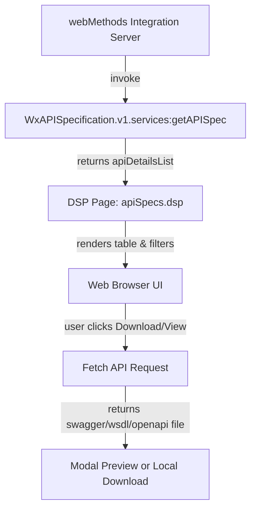

# WxAPISpecification
# 🌐 API Specifications DSP Page

## 🧭 Architecture Overview

📘 README.md – API Specifications DSP Page
🧩 Overview

This DSP (Dynamic Server Page) provides a clean, responsive, and dynamic UI to view, search, copy, and download API specifications (Swagger, OpenAPI, WSDL) directly from webMethods Integration Server.

It lists APIs dynamically by Package, API Name, and Type, supports advanced filtering, and enables in-browser preview and downloads with the correct file formats.

🚀 Features

✅ Dynamic API Listing

Fetches API details dynamically from %invoke WxAPISpecification.v1.services:getAPISpec%.

Populates the table with package, API name, type, Download and view.

✅ Smart Filtering

Dropdown filters for Package, API Name, and Type

A Global Search box filters across Package Name and API Name

A Clear Filters button resets all dropdowns and search terms instantly

All filters work together dynamically and case-insensitively

✅ Smart Downloads

Automatically detects API type and applies the correct download logic:

Swagger → ?swagger.json → *_swagger.json

OpenAPI → ?openapi.json → *_openapi.json

WSDL → ?wsdl → *.wsdl

Downloads are triggered entirely in-memory using JavaScript fetch() (no page reload).

👁️ View API Specification (Modal Preview)

Clicking “View” opens a responsive modal showing the full API specification (Swagger JSON / OpenAPI / WSDL).

Automatically fetches and pretty-prints content inside the modal.

Works for all API types (swagger, openapi, wsdl).

📋 Copy to Clipboard

Inside the modal, a “Copy to Clipboard” button copies the API specification content as plain text.

Useful for sharing API definitions or debugging.

⬇️ Download

The “Download" button allows users to download the same file they are currently previewing.

Uses the same smart type detection and naming convention as standard downloads.

🎨 Clean UI & Behavior

Responsive layout that fits the screen

Hover highlights and consistent spacing

Auto-refresh every 600 seconds (via meta refresh)

Subtle modal animations and buttons for better UX

⚙️ How It Works

DSP Data Invocation

%invoke WxAPISpecification.v1.services:getAPISpec%

Returns a list named apiDetailsList with:

## API Details Table

| **Field Name** | **Description** |
|----------------|------------------|
| `packageName`  | Name of the Integration Server package that contains the API. |
| `apiName`      | Name of the API service extracted from the full API identifier. |
| `type`         | Type of the API — can be `Swagger`, `WSDL`, or `OpenAPI`. |
| `Download`     | Download URL pointing to the Swagger/OpenAPI/WSDL definition of the API. |
| `View`         | View pointing to the Swagger/OpenAPI/WSDL definition of the API. |

Rendering Logic

The %loop apiDetailsList% block renders each API row dynamically.

The apiName is displayed as text after the first colon (:) for readability.

JavaScript captures data-* attributes for dynamic filtering and download handling.

Filter & Search

Dropdowns are populated from unique data values.

Search box filters rows by partial match in Package or API Name.

Filtering is case-insensitive.

Download Logic

On clicking “Download,” a file is fetched and saved locally using the correct filename and extension.

Handles different endpoint variations automatically.

🧠 Key Implementation Points
| **Area** | **Description** |
|----------------|------------------|
| `packageName`  			| Name of the Integration Server package that contains the API. |
| `Dynamic Content`  		| 	Uses DSP tags to render API rows dynamically
| `JavaScript Filtering`  	| 	Lightweight, client-side search and filter
| `Type Detection`  		| 	Automatically identifies swagger, openapi, or wsdl
| `Modal Preview`  			| 	Fetches and displays content inline without leaving the page
| `Copy & Download`  		| 	Provides both copy and save options from modal
| `Error Handling`  		| 	Alerts users for fetch or network errors
| `UI Styling`  			| 	Clean, responsive layout with subtle effects

📁 Expected Backend Output

Example output from the backend service (WxAPISpecification.v1.services:getAPISpec):

{
  "apiDetailsList": [
    {
      "packageName": "EmployeeService",
      "apiName": "EmployeeService:getEmployeeList",
      "type": "swagger",
      "endpointUrl": "http://localhost:5555/restv2/EmployeeService"
    },
    {
      "packageName": "FinancePackage",
      "apiName": "FinanceService:getStatement",
      "type": "wsdl",
      "endpointUrl": "http://localhost:5555/ws/FinanceService"
    }
  ]
}

---

## Supported Versions

This DSP page has been tested and verified to work with **Software AG Integration Server 10.15 and above**.

- ✅ **Supported:** 10.15, 11.x   
- 🚫 **Not supported:** Versions below 10.15

---
🧩 How to Deploy

Place the DSP File

Copy the .dsp file into your package’s pub directory:

IntegrationServer/packages/MyPackage/pub/apiSpecs.dsp

Add below Global Variables
| **Name**           | **Value**                                                    | **Description**                                                |
|-------------------|-------------------------------------------------------------|----------------------------------------------------------------|
| `hostAddress`     | `http://localhost:5555`                                     | HostName/IP address of the Integration Server.                |
| `pkgToSkipRegex`  | ``^(Wm\|Wx\|Svg\|Abc\|Default\|PackageName).*``           | Name of the Integration Server Package or Prefix to skip.     |

Reload or Restart Package

Reload via Integration Server Admin Console, or:

Packages → Management → Reload Package

Access the Page

http://server:port/MyPackage/apiSpecs.dsp

Use the UI

Select filters or type in the search bar.

Click Download to retrieve the file.

Click Clear Filters to reset view.

🔍 Troubleshooting
| Issue                | Possible Cause / Fix                                                                  |
| -------------------- | ------------------------------------------------------------------------------------- |
| Table is empty       | Backend service not returning `apiDetailsList`.                                       |
| Download fails       | Check endpoint URL and permissions.                                                   |
| Wrong file extension | Verify the `type` field (`swagger`/`openapi`/`wsdl`) matches the actual service type. |
| “Auth fail”          | Check Integration Server alias or credentials (not DSP-related).                      |

🧱 Tech Stack
| **Component**            | **Description**                          |
| ------------------------ | ---------------------------------------- |
| **DSP**                  | For dynamic server-side rendering        |
| **JavaScript (Vanilla)** | Filtering, event handling, and downloads |
| **HTML5 + CSS3**         | Structure, layout, and modal UI          |
| **Integration Server**   | Backend platform for DSP execution       |

🏁 Summary

This DSP provides a single, self-contained, no-dependency UI for browsing and downloading API specs directly from Integration Server.
It simplifies API discovery, documentation validation, and DevOps automation within your integration environment.
